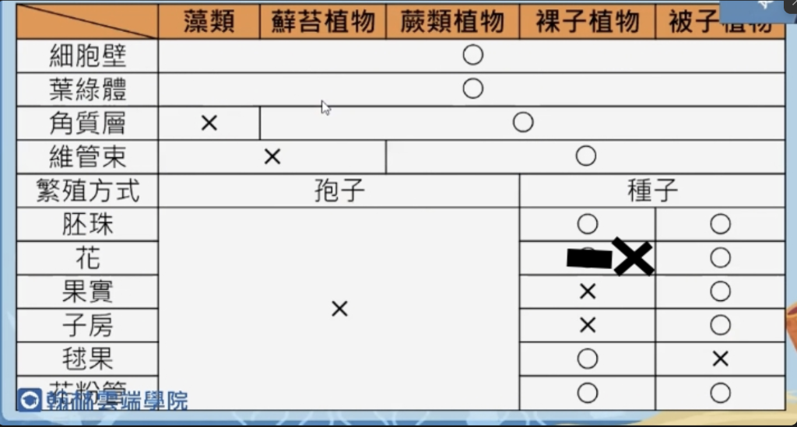
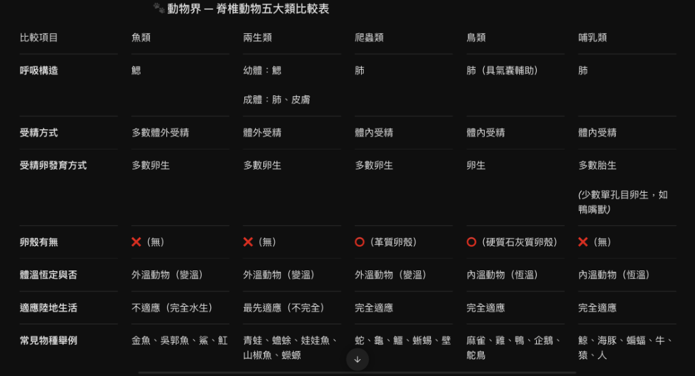

# 自然科重點筆記 (Science Notes)

* **教科書版本**：翰林版（七～九年級國中自然：生物 / 理化 / 地科）
* **收錄原則**：圖表化歸納自然科學核心實驗、觀念機轉與動植物演化分類，**不記錄日期**。

---

## 📌 重點 1：植物界五大族群演化與構造特徵全比較

### 🏷️ 分類資訊
* **科目**：自然/生物（翰林版）
* **單元章節**：七年級下學期 第 2 章 生物的分類與植物界
* **核心知識點**：藻類、蘚苔、蕨類、裸子植物、被子植物五大族群器官構造與演化適應

### 💡 核心觀念精粹
1. **登陸防失水（角質層）**：蘚苔植物開始演化出角質層適應乾燥陸地環境，藻類生活於水中無角質層。
2. **運輸與長高（維管束）**：蕨類植物首度演化出維管束，具備真根、莖、葉，植物體開始能向上長高（如筆筒樹）。
3. **脫離水分受精（種子與花粉管）**：裸子與被子植物演化出花粉管輸送精細胞，受精**不再需要水為媒介**，耐旱抗逆境。
4. **繁衍頂峰（花、果實、子房）**：被子植物獨具子房保護胚珠，受精後發育成果實保護種子，為陸地最優勢族群。

### 📊 植物界五大族群特徵速查比較表

| 構造 / 特徵項目 | 藻類 (原生生物) | 蘚苔植物 | 蕨類植物 | 裸子植物 | 被子植物 (開花植物) |
|---|:---:|:---:|:---:|:---:|:---:|
| **細胞壁 / 葉綠體** | ○ | ○ | ○ | ○ | ○ |
| **角質層 (登陸適應)** | × | ○ | ○ | ○ | ○ |
| **維管束 (長高關鍵)** | × | × (矮小無真根莖葉) | ○ (首度演化出) | ○ | ○ |
| **繁殖方式** | 孢子 | 孢子 | 孢子 | 種子 | 種子 |
| **胚珠** | × | × | × | ○ (裸露無子房) | ○ (包於子房內) |
| **花** | × | × | × | × (無真正的花) | ○ (唯一的開花植物) |
| **果實 / 子房** | × / × | × / × | × / × | × / × | ○ / ○ (果實保護種子) |
| **毬果** | × | × | × | ○ (專屬毬果) | × |
| **花粉管 (受精免水)** | × (精子游水) | × (精子游水) | × (精子游水) | ○ (免水受精) | ○ (免水受精) |

🔍 <b>[教學重點截圖]（點擊可展開/收合，點擊下方圖片可原地放大）</b>

<input type="checkbox" id="zoom-science-1" class="zoom-toggle">
<label for="zoom-science-1" class="zoom-label">
  
</label>

### 🧠 記憶口訣與破題密碼
> 💡 **【黃金演化階梯口訣】**
> - **四步演化訣**：「蘚苔長角質，蕨類有血管；裸被通水管（花粉管），被子抱子房！」
> - **秒殺金律**：題目只要看到「花」、「果實」、「子房」，必定是**被子植物**；看到「毬果」秒選**裸子植物**！

---

## 📌 重點 2：被子植物（開花植物）雙子葉 vs. 單子葉大對決

### 🏷️ 分類資訊
* **科目**：自然/生物（翰林版）
* **單元章節**：七年級下學期 第 2 章 生物的分類與植物界
* **核心知識點**：被子植物分類、雙子葉植物與單子葉植物五大形態特徵對比

### 💡 核心觀念精粹
1. **被子植物定義**：會開花並結出果實（開花植物），依種子內子葉數分為雙子葉與單子葉植物。
2. **五大形態指標完全對比**：
   - **子葉數量**：雙子葉 2 片（花生、大豆）；單子葉 1 片（玉米、水稻）。
   - **花瓣數量**：雙子葉為 4 或 5 的倍數；單子葉為 3 或 3 的倍數。
   - **葉脈型態**：雙子葉為「網狀脈」；單子葉為「平行脈」。
   - **莖維管束**：雙子葉呈「環狀排列」且有形成層（能加粗）；單子葉呈「散生排列」且無形成層。
   - **根的型態**：雙子葉為「軸根系」（主根明顯）；單子葉為「鬚根系」（叢生細鬚）。

### 📊 雙子葉植物 vs. 單子葉植物特徵全對照表

| 比較項目 | 雙子葉植物 (Dicot) | 單子葉植物 (Monocot) | 生活常見植物代表 |
|---|---|---|---|
| **子葉數目** | **2 片** | **1 片** | 雙子葉：花生、大豆 單子葉：玉米、水稻 |
| **花瓣數目** | **4 或 5 的倍數** | **3 或 3 的倍數** | 雙子葉：梅花 (5瓣) 單子葉：百合 (6瓣 = 3×2) |
| **葉脈型態** | **網狀脈** (葉片寬) | **平行脈** (長條狀) | 雙子葉：菩提、楓葉 單子葉：竹子、青蔥、韭菜 |
| **莖維管束** | **環狀排列** (有形成層，能加粗) | **散生排列** (無形成層，不能加粗) | 雙子葉多木本樹木 單子葉多草本（竹、玉米） |
| **根系型態** | **軸根系** (明顯主根深扎) | **鬚根系** (整叢細鬚根) | 拔蔥看根是一把鬚（鬚根系）！ |

🔍 <b>[教學重點截圖]（點擊可展開/收合，點擊下方圖片可原地放大）</b>

<input type="checkbox" id="zoom-science-2" class="zoom-toggle">
<label for="zoom-science-2" class="zoom-label">
  
</label>

### 🧠 記憶口訣與破題密碼
> 💡 **【單雙子葉秒殺口訣】**
> - **單子葉口訣**：「一葉三花平行脈，散生鬚根無層次！」
> - **雙子葉口訣**：「雙葉四五網狀脈，環狀軸根有層次！」

---

## 📌 重點 3：動物界 — 脊椎動物五大類比較表

### 🏷️ 分類資訊
* **科目**：自然/生物（翰林版）
* **單元章節**：七年級下學期 第 2 章 生物的分類與動物界
* **核心知識點**：魚類、兩生類、爬蟲類、鳥類、哺乳類呼吸器官、受精方式、卵生胎生與體溫恆定

### 💡 核心觀念精粹
1. **呼吸器官演化**：魚類用鰓；兩生類幼體用鰓、成體用肺與皮膚；爬蟲、鳥、哺乳類皆用肺（鳥類具氣囊輔助飛行散熱）。
2. **生殖與受精適應**：魚類與兩生類多體外受精、卵無卵殼（受精繁殖離不開水）；爬蟲、鳥、哺乳類為**體內受精**，爬蟲具革質卵殼、鳥類具硬質石灰質卵殼，生殖完全適應陸生！
3. **體溫調節恆定性**：魚、兩生、爬蟲類為**外溫動物（變溫）**；鳥類與哺乳類為**內溫動物（恆溫）**。
4. **哺乳類特徵**：多數胎生、具乳腺分泌乳汁哺育幼兒；少數單孔目卵生（如鴨嘴獸、針鼴）。

### 📊 脊椎動物五大類特徵全對照表

| 比較項目 | 魚類 | 兩生類 | 爬蟲類 | 鳥類 | 哺乳類 |
|---|---|---|---|---|---|
| **呼吸構造** | 鰓 | 幼體：鰓 成體：肺、皮膚 | 肺 | 肺 (具氣囊輔助) | 肺 |
| **受精方式** | 多數體外受精 | 體外受精 | 體內受精 | 體內受精 | 體內受精 |
| **胚胎發育方式** | 多數卵生 | 多數卵生 | 多數卵生 | 卵生 | 多數胎生 (鴨嘴獸卵生) |
| **卵殼有無** | × (無) | × (無) | ○ (革質卵殼) | ○ (硬質石灰質卵殼) | × (無) |
| **體溫恆定與否** | 外溫動物 (變溫) | 外溫動物 (變溫) | 外溫動物 (變溫) | 內溫動物 (恆溫) | 內溫動物 (恆溫) |
| **適應陸地生活** | 不適應 (完全水生) | 最先適應 (不完全) | 完全適應 | 完全適應 | 完全適應 |
| **常見物種舉例** | 金魚、吳郭魚、鯊魚、魟魚 | 青蛙、蟾蜍、娃娃魚、山椒魚 | 蛇、龜、鱷、蜥蜴、壁虎 | 麻雀、雞、鴨、企鵝、鴕鳥 | 鯨、海豚、蝙蝠、牛、人 |

🔍 <b>[教學重點截圖]（點擊可展開/收合，點擊下方圖片可原地放大）</b>

<input type="checkbox" id="zoom-science-3" class="zoom-toggle">
<label for="zoom-science-3" class="zoom-label">
  
</label>

### 🧠 記憶口訣與破題密碼
> 💡 **【脊椎動物秒殺口訣】**
> - **體溫口訣**：「鳥哺真溫暖（內溫恆溫），魚兩爬冷血（外溫變溫）！」
> - **生殖口訣**：「魚兩無殼產水中，爬鳥有殼陸地生，哺乳胎生母乳育！」
