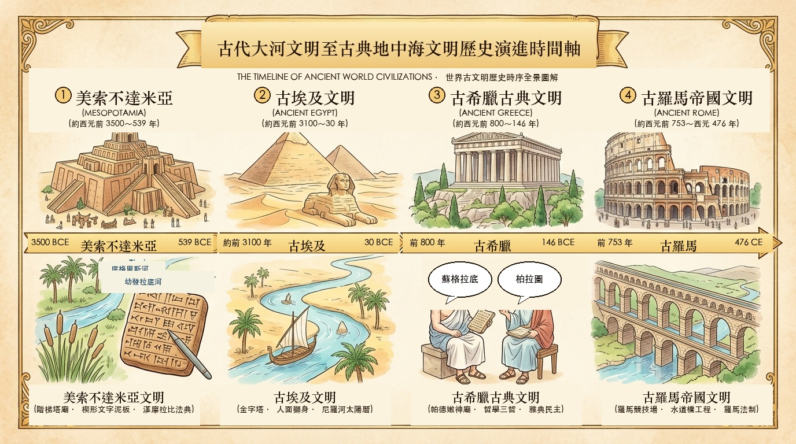

# 社會科重點筆記 (Social Studies Notes)

* **教科書版本**：康軒／翰林／南一版通用（國中九年級上學期歷史：第 1～2 章）
* **收錄原則**：古代大河文明至古典地中海文明縱貫時序全景時間線、會考高頻考點秒殺口訣。**不記錄日期**。

---

## 📌 重點 1：古代大河文明至古典地中海 — 縱貫時序時間線

### 🏷️ 分類資訊
* **科目**：社會（歷史）
* **年級版本**：九年級上學期（康軒／翰林／南一版通用）
* **單元章節**：第 1～2 章 古代大河文明至古典地中海文明
* **核心知識點**：一條時間線掌握：大河文明、希臘城邦、亞歷山大希臘化、羅馬帝國與基督教演進

### 💡 核心觀念精華
1. **大河文明**：兩河悲觀現世、埃及樂觀來世、印度種姓佛教、波斯驛道寬容。
2. **希臘與希臘化**：雅典民主哲學、斯巴達軍國、亞歷山大融匯東西與實用科學。
3. **羅馬與基督教**：共和擴張法制、屋大維羅馬和平、西元 476 年西羅馬亡入中古。

---

### ⏳ 縱貫時序全景時間線 (Historical Timeline)

#### 🌊 一、大河流域古文明曙光（約西元前 3500 年 ～ 西元前 6 世紀）
* **約西元前 3500～539 年** 📜 **西亞兩河流域（美索不達米亞）**
  * **蘇美文明**：首創「楔形文字」（泥板）、六十進位法、陰曆、階梯塔廟。
  * **巴比倫**：《漢摩拉比法典》採「以牙還牙」同態復仇，依階級判刑。
  * **地理特徵**：平坦無天然屏障易遭侵略，信仰悲觀重現世祈福。
  * > 💡 **秒殺口訣**：蘇美造字星神廟，巴比以牙還牙條；平坦無險悲觀現世！

* **約西元前 3100～30 年** 🌅 **埃及尼羅河流域文明**
  * **政教合一**：法老為太陽神之子，統治威權至高。
  * **樂觀重來世**：相信靈魂復活，製作木乃伊、建造金字塔陵墓。
  * **科學發明**：象形文字（草紙）、太陽曆（一年 365 天）、幾何測量。
  * > 💡 **秒殺口訣**：兩河悲觀用陰曆；埃及樂觀重來世用太陽曆！

* **約西元前 2500 年～西元前 3 世紀** ☸️ **古印度文明與種姓制度**
  * **種姓制度**：雅利安人創婆羅門教，確立四大世襲階級（貴賤不可跨越）。
  * **佛教創立**：釋迦牟尼提倡「眾生平等」、因果輪迴，反對種姓不平等。
  * **阿育王弘法**：孔雀王朝阿育王立石柱宣揚佛法，傳播至東南亞。
  * > 💡 **秒殺口訣**：種姓階級世襲；佛教提倡眾生平等反對種姓！

* **約西元前 1500～330 年** ⛵ **地中海東岸傳播者與波斯帝國**
  * **腓尼基人**：善航海經商，傳播「腓尼基字母」（西方拼音文字源頭）。
  * **希伯來人**：創「猶太教」，確立一神信仰，尊奉《舊約聖經》。
  * **波斯帝國**：橫跨歐亞非；修築驛道；設行省制；信祅教；政策寬容。
  * > 💡 **秒殺口訣**：波斯寬容通驛道，希伯一神舊約照，腓尼基字母傳四方！

#### 🏛️ 二、希臘古典時代（城邦與哲學，約西元前 8 世紀 ～ 西元前 4 世紀）
* **西元前 8 世紀～西元前 5 世紀** ⚖️ **希臘城邦興起：雅典民主 vs. 斯巴達軍國**
  * **城邦林立**：多山環海地形造就各自獨立城邦，以雅典與斯巴達為代表。
  * **雅典**：工商業發達，推行民主（公民大會、陶片放逐法），文藝繁盛。
  * **斯巴達**：內陸農業，推行嚴酷全民軍國教育，寡頭專制尚武。
  * > 💡 **秒殺口訣**：雅典重民主思辨；斯巴達重軍國寡頭！

* **西元前 492～404 年** ⚔️ **波希戰爭勝利與伯羅奔尼撒戰爭內鬨**
  * **波希戰爭**：希臘城邦團結擊退波斯帝國入侵。
  * **雅典黃金時代**：帕德嫩神廟、哲學三哲（蘇格拉底、柏拉圖、亞里斯多德）。
  * **伯羅奔尼撒戰爭**：雅典與斯巴達爆發內戰，兩敗俱傷，城邦由盛轉衰。
  * > 💡 **秒殺口訣**：哲學三哲蘇柏亞；希臘城邦因內戰衰弱，後亡於北方馬其頓！

#### 🌏 三、亞歷山大東征與希臘化時代（西元前 336 年 ～ 西元前 30 年）
* **西元前 334～323 年** 🐎 **亞歷山大大帝東征建立跨歐亞非帝國**
  * **建立大帝國**：滅波斯帝國，推進至印度河流域，版圖跨歐亞非三洲。
  * **推動文化融合**：提倡東西聯姻，廣建希臘式城市（亞歷山卓城）。
  * > 💡 **秒殺口訣**：亞歷山大大帝推動希臘文化與西亞、埃及文化大融合！

* **西元前 323～前 30 年** 📐 **希臘化時代：實用科學與個人哲學鼎盛**
  * **文化重心轉移**：重心由希臘半島移至埃及「亞歷山卓城」。
  * **自然科學高峰**：歐幾里得（幾何原本）、阿基米德（浮力與槓桿）。
  * **個人安頓哲學**：斯多噶學派（理性克己、世界主義）與伊比鳩魯（平靜快樂）。
  * > 💡 **秒殺口訣**：希臘化時代文化重心在埃及亞歷山卓，實用科學成就最亮眼！

#### 👑 四、古羅馬帝國盛世與基督教演進（西元前 509 年 ～ 西元 476 年）
* **西元前 509～27 年** 🏛️ **羅馬共和體制與地中海霸權擴張**
  * **共和制度**：執政官掌行政軍事、元老院掌決策、公民大會投票。
  * **十二表法**：羅馬第一部成文法，保障平民權益，奠定成文法基礎。
  * **地中海霸權**：布匿戰爭擊敗迦太基，地中海成為羅馬人的「我們的海」。
  * > 💡 **秒殺口訣**：十二表法立成文，布匿戰爭霸地中海，凱撒遇刺共和終！

* **西元前 27 年～西元 180 年** 👑 **羅馬帝國建立與「羅馬和平」兩百年盛世**
  * **開創帝制**：屋大維獲封「奧古斯都」，開創兩百年「羅馬和平」（Pax Romana）。
  * **建築與法律**：發明混凝土、圓頂拱券（競技場、萬神殿、引水道）；推行萬民法。
  * > 💡 **秒殺口訣**：第一位皇帝是「屋大維（奧古斯都）」！羅馬特長為實用工程與法學！

* **西元 1 世紀～西元 392 年** ✝️ **基督教興起、合法化與定為國教**
  * **創立與受迫害**：耶穌於巴勒斯坦創立基督教（博愛救贖），初期遭迫害。
  * **西元 313 年《米蘭詔令》**：君士坦丁大帝頒布，基督教「合法化」。
  * **西元 392 年定為國教**：狄奧多西皇帝正式定基督教為「帝國唯一國教」。
  * > 💡 **秒殺口訣**：西元 313 年君士坦丁是「合法化」；西元 392 年狄奧多西才是「定為國教」！

* **西元 395～476 年** 🛡️ **帝國分裂與西羅馬滅亡（歐洲步入中古時代）**
  * **西元 395 年分裂**：正式分裂為「西羅馬帝國」與「東羅馬帝國（拜占庭）」。
  * **西元 476 年西羅馬滅亡**：日耳曼人入侵，西羅馬滅亡，歐洲結束古典時代步入「中古世紀」。
  * > 💡 **秒殺口訣**：西元 476 年西羅馬滅亡 = 歐洲中古世紀開始的劃時代分界點！

---

### 📐 關鍵速查比較大表

| 核心指標 | 古希臘古典時代 | 希臘化時代 | 古羅馬時代 |
|---|---|---|---|
| **政治體制** | 城邦獨立 (雅典民主 / 斯巴達軍國) | 專制大帝國 (歐亞非東西大融合) | 共和轉帝制 (屋大維奧古斯都) |
| **文化重心** | 希臘半島雅典城邦 | 埃及「亞歷山卓城」 | 義大利羅馬城 |
| **核心成就** | 民主政治、哲學三哲 (蘇/柏/亞) | 實用科學 (歐幾里得幾何 / 阿基米德) | 實用法學 (羅馬法)、圓頂拱券工程 |
| **宗教演進** | 奧林帕斯多神教、奧運祭神 | 希臘神話與東方宗教融合 | 基督教合法化(313)至立為國教(392) |
| **時代終局** | 內戰衰微，亡於北方馬其頓 | 各王國相繼亡於羅馬 | 西元 476 年西羅馬滅亡，步入中古 |

🔍 <b>古代大河文明至古典希臘城邦與羅馬帝國歷史演進全景圖解（點擊可展開/收合，點擊下方圖片可原地放大）</b>

<input type="checkbox" id="zoom-social-1" class="zoom-toggle">
<label for="zoom-social-1" class="zoom-label">
  
</label>

---

### 🧠 記憶口訣與秒殺密碼
> 💡 **【大河流域秒殺口訣】**
> - 「蘇美造字星神廟，巴比以牙還牙條；埃及樂觀來世照，波斯寬容通驛道！」
>
> 💡 **【希臘羅馬演進口訣】**
> - 「希臘愛民主思辨，羅馬重法制工程；亞歷山大融東西，屋大維創羅馬平；三一三合法信基督，四七六西羅入中古！」

---

### 🎯 會考經典互動範例示範

* **經典試題一**：小麥在歷史博物館看到一塊古代石碑複製品，上方刻滿楔形文字，記載著一條法條：「若自由民弄瞎另一自由民之眼，則毀其眼；若傷及奴隸，則僅需賠償其身價之一半。」請問這部法典最可能出自哪一個文明？具有何種法律特色？
  * **正確選項**：**(B) 美索不達米亞古巴比倫王國，採同態復仇原則但強調階級不平等**
  * **解析**：這是古巴比倫《漢摩拉比法典》的典型條文，以楔形文字書寫，採取「以牙還牙、以眼還眼」同態復仇原則，但依據貴族、平民、奴隸不同階級給予差別刑罰，重視階級不平等。

* **經典試題二**：國三歷史課堂上進行「地中海古典文明接力賽」，四位同學各發表了一句歷史陳述，請問哪一位同學的說法完全正確？
  * **正確選項**：**(C) 小潔：「屋大維擊敗政敵後被尊為奧古斯都，開創長達兩百年的『羅馬和平』」**
  * **解析**：屋大維在內戰結束後獲得元老院尊贈「奧古斯都」稱號，開創帝制，帶來政局穩定、商旅暢通的兩百年「羅馬和平（Pax Romana）」。
